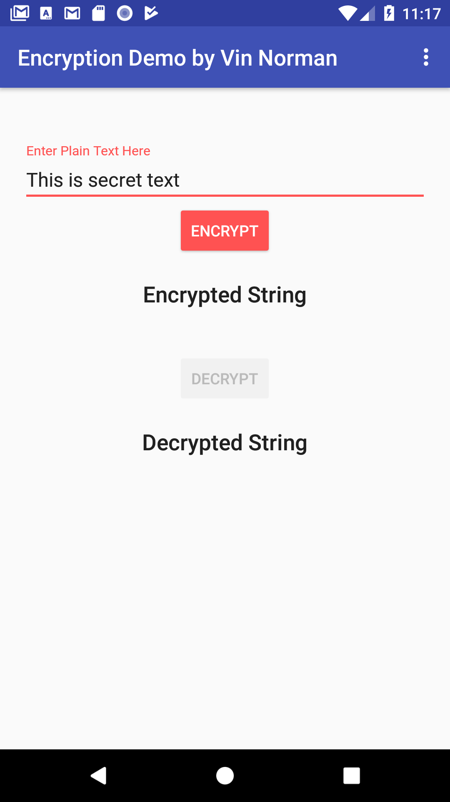
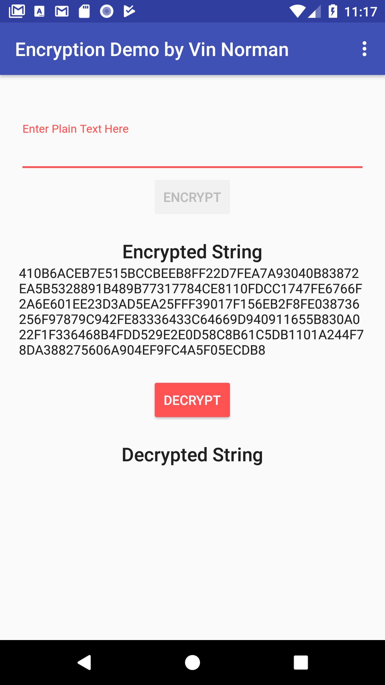
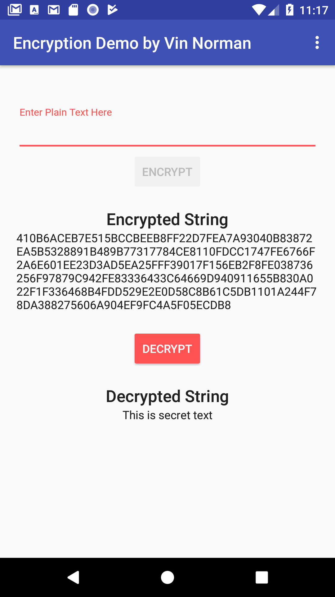

# Demonstration of Encryption on Android
#### By Vin Norman

This project is in response to a technical test from a potential employer.

## The Brief

1. Application should have a main screen with ability to let user enter plain text
2. Main screen should have a way to display a user two results:  “Encrypted String” and “Decrypted String”
3. Main screen should have two buttons “Encrypt” and “Decrypt”.
4. When user enters plain text and clicks “Encrypt” a new KeyPair should be created.
5. With a KeyPair the passed plain text should be encrypted and shown back to the user in a readable format
6. User should have an ability to press “Decrypt” button to decrypt the encrypted String, and show the original plain text back to the User using the same KeyPair.

## My response

I did a little background research on encryption to further my understanding. Primarily this involved a foundational understanding of the two widespread types of encryption used today, symmetric and asymmetric encryption, as well as some background in a popular example of each (AES for symmetric, RSA for asymmetric). 

I selected the RSA algorithm as there appeared to be good standard built-in Android/Java support for this, and also as it was necessary to have an encryption algorithm that was asymmetric - that is, with public and private key pairs - to fulfil the brief.

I came to a solution in the following steps:
 - Wire-frame the app, with basic layout and all necessary widgets, and get all view references in main activity, and add some dummy button click listeners
 - Import the necessary classes for the encryption functionality, and create the encryption and decryption methods (to a byte array)
 - Create methods to output the text to a readable format (in this case, Hex string) and also from Hex back to a byte array
 - Connect these methods to the appropriate buttons and views, and check working as expected
 - Add Android activity lifecycle data persistence e.g. if user rotates device, persist the encrypted string and accompanying private key
 - Apply a little styling, although without going overboard as this was not part of the brief
 - Tidy the code, seperating all encryption logic into EncryptionHelper class, and seperating functionality in Main Activity into seperate methods
 
## Screenshots

    

This fulfils the brief, however if I was to go further I would probably look to enhance the encryption as there is a small size limit to encrypting the plain text using RSA. With research, I discovered a standard solution to this is to encrypt the data with a symettric algorithm (e.g. AES), encrypt the AES secret key using RSA, and store the encrypted string and encrypted AES key together, and decrypt the AES key using the RSA private key, and subsequently use the decrypted AES key for the encrypted string.
